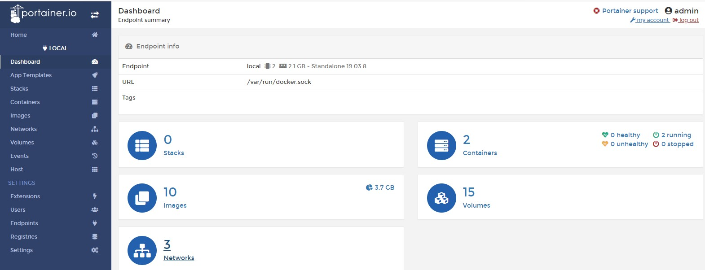
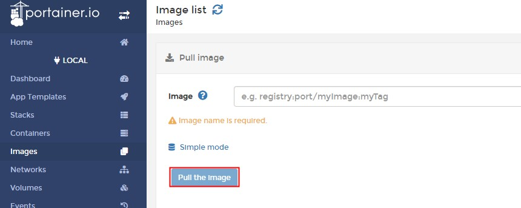
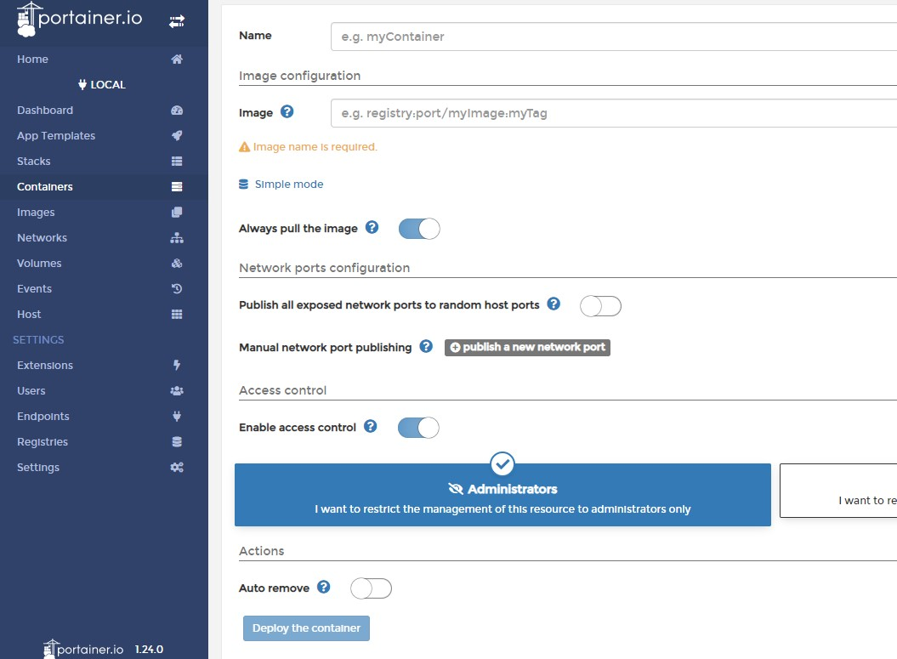
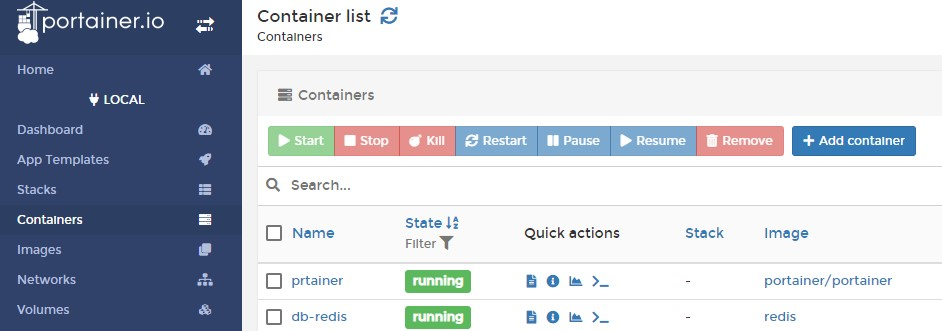

# 使用Portainer管理Docker镜像&容器
Portainer可用于可视化管理Docker镜像和容器，包括：下载上传镜像，创建、启动、停止、移除容器等。

* 搜索镜像源

    `docker search portainer`

* 下载官方镜像

    `docker pull portainer/portainer`

* 启动portainer
    
    `docker run -d -p 9000:9000 -v /var/run/docker.sock:/var/run/docker.sock --restart=always --name portainer portainer/portainer`
    >- 这里一定要使用`-v`进行挂载，登入portainer后配置连接local/remote docker进程时会检查

* portainer功能展示
    - dashboard
    

    - pull image
    

    - run container
    

    - manage container
    

    
    ps:
    
    以上只是管理本地docker的设置，管理remote的后续用到再记录。

## 参考
* [docker：轻量级图形页面管理工具Portainer](http://www.secflag.com/archives/413.html)